# AutoML-Gr4
  AutoML is a learning project trying to make a webapp where people can process data and train some ML models. 
  It's main inspiration is Dataiku DSS and it uses pandas and sklearn to process data in the backend. 
   
  
  ---
  
  ---
